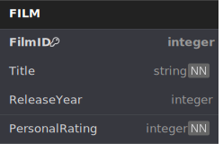
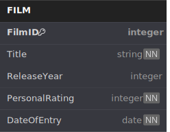
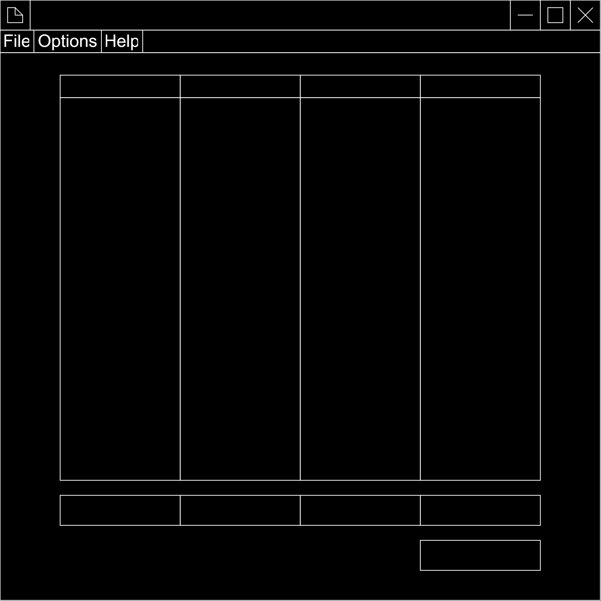

<link href="stylesheet.css" rel="stylesheet"></link>

# 
Local Movie Database

## 
Will Dargan

## 
Summer 2024

## Contents
<ul class="leaders">
    <li>1 - Abstract<strong>3</strong></li>
    <li class="nested">
        <ul class="leaders inner">
            <li>1.1 - Features<strong>3</strong></li>
            <li>1.2 - Libraries<strong>3</strong></li>
            <li class="nested">
                <ul class="leaders inner">
                    <li>1.2a - SQLite3<strong>3</strong></li>
                    <li>1.2b - Tkinter<strong>3</strong></li>
                </ul>
            </li>
        </ul>
    </li>
</ul>

## 1 - Abstract
This program provides a GUI wrapper for searching and editing an SQLite3 database storing data about any number of films the user wishes to store. The program is set up in a portable design by default, however file paths can be changed by the user at a later date. The program also allows for a number of aesthetic customisations by the user.
### 1.1 - Features
This program includes the following features:
1. A table with which the user may view a number of records of the database.
   * Includes anchored headings for each column
   * Scrollable JiT loaded records from the database
2. A menubar which provides access to a separate settings menu and save and load functionality.
3. A separate menu for changing global settings.
   * The ability to change save locations
   * The ability to edit the database schema
   * The ability to change the appearance of the app
### 1.2 - Libraries
The libraries used to interface with the database and produce the GUI are both included in Python's standard library. These are SQLite3 and Tkinter respectively. Other libraries may ultimately be used in the development of this project, however the two aforementioned libraries will definitely feature in the final program.
#### 1.2a - SQLite3
This library is a Python wrapper for the original SQLite C module. It provides classes and methods for interfacing with a local disk stored database and does not require a separate server to host the database itself. Due to this nature, SQLite is suited to small, fast-access databases making it perfect for this sort of application.
#### 1.2b - Tkinter
The inclusion of Tkinter in the Python standard library and the fact that it is a wrapper for a C library means that there is plenty of documentation available for all of the included features. The library also uses a simple system of customisable preset widgets which makes the creation of small interactive applications quick and easy. Given the narrow scope of this project, Tkinter should be a perfect choice for a GUI library.

## 2 - Basic Database Design
At defaults the program only uses a flat file database as little data is stored about each film. The first draft of an entity relationship diagram for the database is as follows:

The `FilmID` field is an auto-incremented value and is used merely as a unique primary key for each record; the `ReleaseYear` field is currently optional, however will be clamped betwwen the years of 1888 and one year following the data of entry. The two remaining fields are both required.
#### First Revision
While writing the previous section of this documentation I realised it may be helpful the search or order records based upon the date upon which they were entered into the database. This requires an extra column in the table shown below:

This new column will be populated automatically using the current system date and time.
#### Optional Columns
I had thought to add a column to the database for the director of the film, however I realised that this may not be desireable for every user so I am instead adding it as an optional field toggleable by the user. Under the settings menu there will be a button to add the new column to the database schema. This could be done through editing the database schema manually, however not every user is likely to be knowledgable enough to do this, hence the simple to use button. Other optional fields could include writers and producers.

## 3 - UI Design
The main window of the program will contain a toolbar at the top for navigating to other parts of the program; the main table displaying records from the database and a number of fields for creating new records. The following diagram displays a fairly rudimentary wireframe of a possible design for the main page of the program:

One of the options under the `Options` tab of the toolbar is the settings menu for the program. This menu will open in a new window; an initial design for this window follows:

## 4 - Development
This section contains a log of the development of the final programmed product. It follows a mostly chronological order, however some modules that are suited to go earlier than their chronological position have been moved there; most noteably some of the custom widgets.
### 4.1 - Custom Widgets
These modules are all modifications or amalgamations of default Tkinter widgets that have been created to aid the development of the whole app. There is also a custom module used in the program that was written by me for a different project, so the development process for that is not included.
#### 4.1a - Affixed Entry Widget
For on of the fields for creating a new record in the database I wanted to apply an uneditable suffix to the users input and display that in the entry widget. Therefore, I decided to create a custom widet for this that allows both preffixes and suffixes as this may come in handy for future projects also.